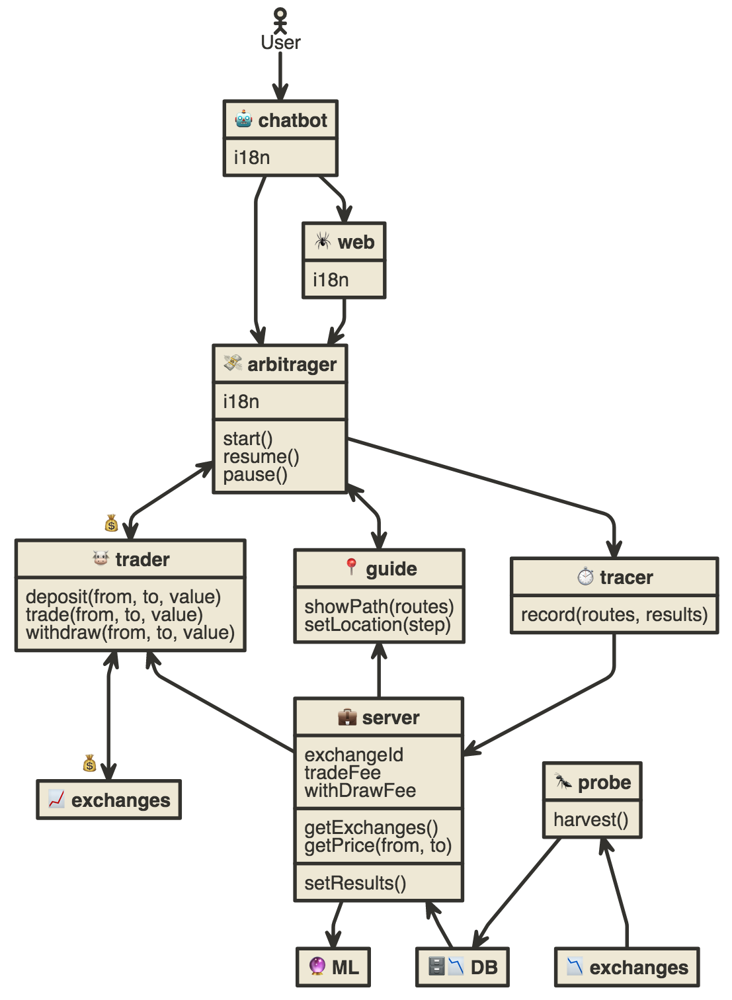

# harvest
🐝 Project Harvest (ハーヴェスト Hāvesuto)


> [EDIT](http://www.nomnoml.com/#view/%5B%3Cactor%3EUser%5D-%3E%5B%F0%9F%A4%96%20chatbot%5D%0A%0A%5B%F0%9F%A4%96%20chatbot%7Ci18n%5D%0A%5B%F0%9F%A4%96%20chatbot%5D-%3E%5B%F0%9F%92%B8%20arbitrager%5D%0A%5B%F0%9F%A4%96%20chatbot%5D-%3E%5B%F0%9F%95%B7%20web%5D%0A%0A%5B%F0%9F%95%B7%20web%7Ci18n%5D%0A%5B%F0%9F%95%B7%20web%5D-%3E%5B%F0%9F%92%B8%20arbitrager%5D%0A%0A%5B%F0%9F%92%B8%20arbitrager%7Ci18n%7Cstart()%3Bresume()%3Bpause()%5D%0A%5B%F0%9F%92%B8%20arbitrager%5D%3C-%3E%F0%9F%92%B0%5B%F0%9F%90%AE%20trader%5D%0A%5B%F0%9F%92%B8%20arbitrager%5D%3C-%3E%5B%F0%9F%93%8D%20guide%5D%0A%5B%F0%9F%92%B8%20arbitrager%5D-%3E%5B%E2%8F%B1%20tracer%5D%0A%0A%5B%F0%9F%90%AE%20trader%5D%3C-%3E%F0%9F%92%B0%5B%F0%9F%93%88%20exchanges%5D%0A%0A%5B%F0%9F%90%AE%20trader%7C%0Adeposit(from%2C%20to%2C%20value)%3B%0Atrade(from%2C%20to%2C%20value)%3B%0Awithdraw(from%2C%20to%2C%20value)%0A%5D%3C-%5B%F0%9F%92%BC%20server%5D%0A%0A%5B%F0%9F%93%8D%20guide%7CshowPath(routes)%3BsetLocation(step)%5D%0A%5B%F0%9F%93%8D%20guide%5D%3C-%5B%F0%9F%92%BC%20server%5D%0A%0A%5B%E2%8F%B1%20tracer%7Crecord(routes%2C%20results)%5D%0A%5B%E2%8F%B1%20tracer%5D-%3E%5B%F0%9F%92%BC%20server%5D%0A%0A%5B%F0%9F%92%BC%20server%7CexchangeId%3BtradeFee%3BwithDrawFee%7C%0AgetExchanges()%0AgetPrice(from%2C%20to)%7C%0AsetResults()%0A%5D%0A%5B%F0%9F%92%BC%20server%5D%3C-%5B%F0%9F%97%84%F0%9F%93%89%20DB%5D%0A%0A%5B%F0%9F%90%9C%20probe%7Charvest()%5D%0A%5B%F0%9F%90%9C%20probe%5D%3C-%5B%F0%9F%93%89%20exchanges%5D%0A%5B%F0%9F%90%9C%20probe%5D-%3E%5B%F0%9F%97%84%F0%9F%93%89%20DB%5D%0A%0A%5B%F0%9F%92%BC%20server%5D-%3E%5B%F0%9F%94%AE%20ML%5D)

## Develop
```
# Server
cd server
npm i
npm run dev
npm run mon

# Client
cd web
yarn install
yarn start
```

## TODO
### Infra
- [ ] Domain name
- [ ] SSL
- [ ] Helm
- [ ] Email MX
- [ ] Redis HA

### 🐜 Probe
> Will gathering and provide current coins price.
- [x] Exchange adapter bx
- [x] Exchange adapter binance
- [x] Resolver for each market.
- [x] Can swap price e.g. `eth_omg` or `omg_eth`.
- [ ] Result as graph node for made decision and render as routes.

### ⏱ Tracer
> Will collect arbitrage time/fund/profit summary for analysis later.
- [ ] It can collect transfer results.
- [ ] It can estimate transfer cost.

### 🐮 Trader
> Will execute deposit/trade/withdraw.
- [ ] It can deposit and return the results.
- [ ] It can trade and return the results.
- [ ] It can withdraw and return the results.

### 📍 Guide
> Will show routes sort by most profit and highest success.
- [ ] It can show routes sort by most profit and highest success.
- [ ] It can show current step of trade.
- [ ] It have interface for `start`, `resume`, `pause`

### 🐝 Harvester
- [ ] It know floor/ceiling.
- [ ] It know volume.
- [ ] It know collection.
- [ ] It know acceleration.
- [ ] It know velocity.
- [ ] It can predict 1 day trade.
- [ ] It can predict 5 days trade.
- [ ] It can predict 10 days trade.
- [ ] It can signal trade.

### 💸 Arbitrager
> Will show guide and trade.
- [ ] It can show and interact guide.
- [ ] It can use trader to trade and handle the results.
- [ ] It can use trader to deposit and handle the results.
- [ ] It can use trader to withdraw and handle the results.

### 🕷 Web
> Will provide web command interface for arbitrage.
- [ ] It can load prices data from server and show as routes.
- [ ] It can show list of routes and sort by most profit.
- [ ] Input field for start funding.
- [ ] Input field for exchange API key.
- [ ] It has enabled `start` button.
- [ ] It has `resume` with count down for 3 sec button each step
- [ ] It has `pause` button each step for stop process.
- [ ] It can trade on web via trader lib.
- [ ] It can store encrypted `API-KEY` by `uuid` at local storage.
- [ ] It can pin and compare route.
- [ ] It can show current state of arbitrage.

### 🤖 Chatbot
> Will provide chat command interface for arbitrage.
- [ ] Can set and notify user about profit.
- [ ] Open web and link `uuid` for local storage auto-fill `API-KEY` at client side if possible.
